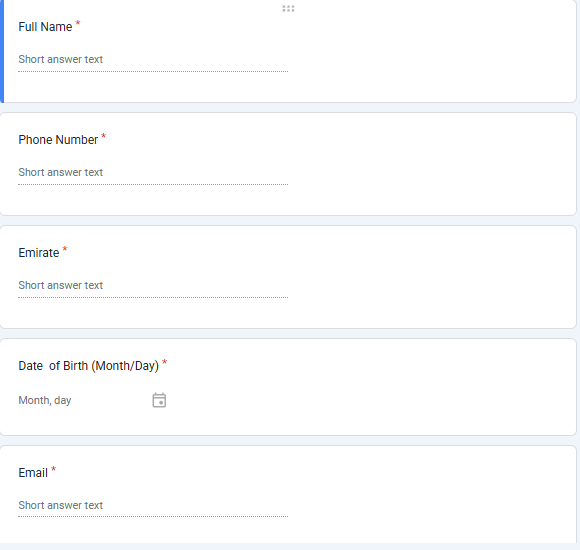
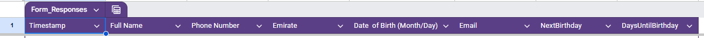

# Anniversary Reminders and Automated Messaging System

This is a simple tool that uses google form to collate church members anniversary dates, then using Google Sheet and App Script to send reminders to admins for upcoming anniversary, and send automated anniversary wishes to celebrants. 

## Implementation Procedure

**1. Create Google Form to Collate Member Data** 
- Below is the Google Form used



**2. Update the Responses Google Sheet to Add Members Next Birthday and Days Until Their Birthday**

- At the top of the google form, click Responses > View in Sheet (to open the responses sheet)
- Google automatically adds first column, "Timestamp"
- From the above Google Form, the Date of Birth is in Column E
- Add 2 columns at the end. Column G: NextBirthday, Column H: DaysUntilBirthday
- Column G: NextBirthday Values (This computes the member's next birthday, based on the Date of Birth in Column E)
```excel
=DATE(
   YEAR(TODAY()) + IF(DATE(YEAR(TODAY()), MONTH(E2), DAY(E2)) < TODAY(), 1, 0),
   MONTH(E2),
   DAY(E2)
)
```
- Column H: DaysUntilBirthday Values (Computes number of days before member's next birthday)
```excel
=G2 - TODAY()

```
- Below is the final columns in the sheet



**3. Deploy The Scripts**

- On the google sheet, click Extensions > Apps Scripts
- Create 2 files, birthdayReminders.gs, birthdayWishes.gs, and paste the respective codes
- Click Triggers > Deploy > New Deployment > Type: web app > Add Description, then Deploy
- Add Trigger > Choose Function (eg SendBirthdayReminder) > Choose the latest version deployed > Event Source: Time-Driven > Type of Time based trigger: Day timer > Time of Day: Choose time you want the reminder email sent > Save
- Repeat the same process for SendBirthdayWishes Function
